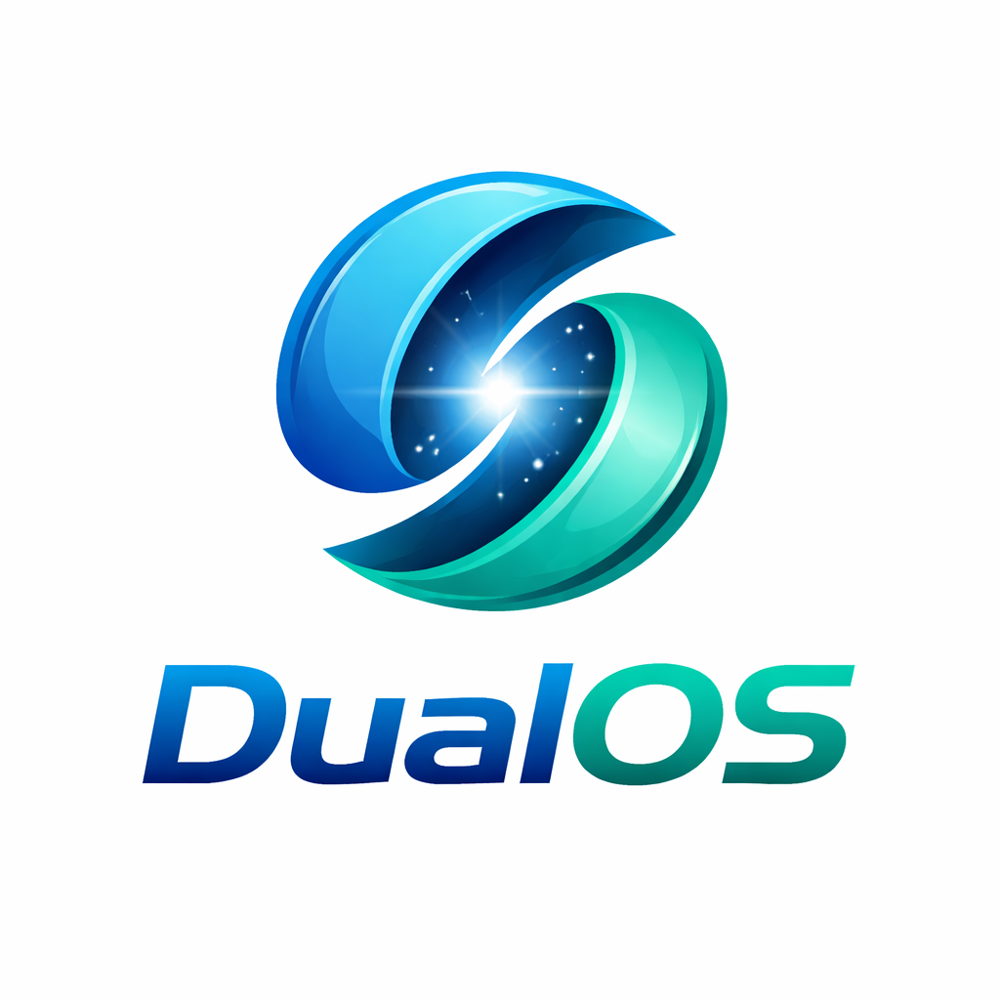

# DualOS

DualOS és un sistema operatiu basat en CosmOS, pensat com un projecte acadèmic per explorar el desenvolupament d’un sistema operatiu modern en .NET/C#.  
L’objectiu inicial és construir una base ordenada i escalable per començar el desenvolupament del sistema.

## Membres del grup
- Pep Catalina
- Jan Vargas
- Guillem Torras

## Logo


> Pendent d’afegir la versió definitiva del logo.
>

## Configuració del teclat

Per defecte, COSMOS OS utilitza el teclat americà. Per poder fer servir un teclat diferent (com l'espanyol), s'ha afegit la següent línia dins de la funció `BeforeRun()`:

```csharp
Sys.KeyboardManager.SetKeyLayout(new Sys.ScanMaps.ESStandardLayout());
```

Això permet configurar el layout del teclat segons les necessitats de l'usuari.
